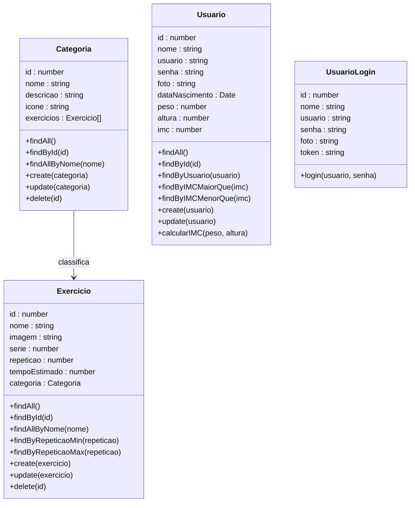
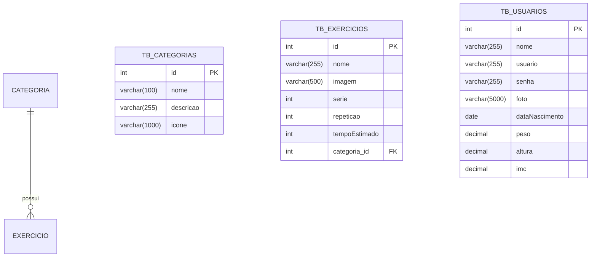

# Solara - API de Treinos Personalizados

<p align="center">
  <a href="https://nestjs.com/" target="blank">
    
  </a>
</p>

<div align="center">
  
  
  
  
  
  
  
</div>

---

## 1. Descrição

A **Solara** é uma plataforma de treinos personalizados desenvolvida pela Orbyte, criada para transformar a prática de exercícios em uma jornada de saúde mais organizada, consistente e personalizada.

A plataforma permite o gerenciamento de usuários, exercícios e categorias musculares, oferecendo uma estrutura para organização dos treinos de acordo com diferentes perfis e objetivos.

A API atua como o núcleo responsável pelo processamento e gerenciamento dos dados da aplicação, disponibilizando recursos por meio de endpoints REST consumidos pelo frontend da Solara.

---

## 2. Sobre a API

Esta API REST foi desenvolvida utilizando **NestJS e TypeScript**, seguindo uma arquitetura modular e organizada por responsabilidades.

O backend é responsável pelo gerenciamento dos principais recursos da plataforma, incluindo usuários, exercícios e categorias, permitindo operações de criação, consulta, atualização e remoção de dados.

A aplicação utiliza **TypeORM** para comunicação com o banco de dados relacional e implementa autenticação baseada em **JWT**, garantindo maior segurança no acesso aos recursos protegidos.

A API também utiliza mecanismos de validação de dados e criptografia de senhas, contribuindo para a integridade e segurança das informações armazenadas.

Para documentação e testes dos endpoints, foi utilizada a ferramenta **Swagger**, possibilitando visualizar e testar os recursos disponibilizados pela API.

A aplicação foi preparada para execução em ambiente de produção utilizando a plataforma **Render**, com banco de dados relacional.

### 2.1. Principais Funcionalidades

**1. Gerenciamento de Usuários**

Permite cadastrar e atualizar usuários, consultar informações do perfil e armazenar métricas corporais como peso, altura e IMC.

**2. Autenticação de Usuários**

Implementa autenticação utilizando credenciais de acesso e geração de token JWT para proteção das rotas que exigem usuário autenticado.

**3. Cálculo de IMC**

O backend realiza automaticamente o cálculo do Índice de Massa Corporal (IMC) com base no peso e altura informados pelo usuário.

**4. Gerenciamento de Exercícios**

Permite criar, consultar, atualizar e excluir exercícios físicos, incluindo informações como nome, imagem, séries, repetições e tempo estimado.

**5. Gerenciamento de Categorias**

Permite criar, consultar, atualizar e excluir categorias de exercícios, possibilitando organizar os exercícios de acordo com grupos musculares ou diferentes objetivos.

**6. Relacionamento entre Categorias e Exercícios**

Os exercícios são associados a categorias, permitindo organizar e consultar os exercícios de acordo com sua classificação.

---

## 3. Diagrama de Classes

O diagrama abaixo representa a estrutura lógica das principais entidades da aplicação e seus relacionamentos.



---

## 4. Diagrama Entidade-Relacionamento (DER)

O DER representa a estrutura dos dados armazenados no banco relacional e o relacionamento entre as entidades da aplicação.



---

## 5. Tecnologias Utilizadas

| Item               | Descrição                           |
| ------------------ | ----------------------------------- |
| **Linguagem**      | TypeScript                          |
| **Runtime**        | Node.js                             |
| **Framework**      | NestJS                              |
| **Arquitetura**    | Modular + REST                      |
| **ORM**            | TypeORM                             |
| **Banco de dados** | MySQL                               |
| **Autenticação**   | Passport + JWT                      |
| **Criptografia**   | Bcrypt                              |
| **Validação**      | class-validator + class-transformer |
| **Documentação**   | Swagger                             |
| **Testes de API**  | Insomnia                            |
| **Deploy**         | Render                              |

---

## 6. Arquitetura do Projeto

O projeto segue a arquitetura modular proposta pelo **NestJS**, separando as responsabilidades da aplicação em diferentes módulos e camadas.

Essa abordagem facilita a manutenção, escalabilidade e evolução do sistema.

A estrutura principal segue a divisão:

* **Controller** → recebe e processa as requisições HTTP
* **Service** → concentra as regras de negócio
* **Entity** → representa as entidades e tabelas do banco de dados
* **Module** → organiza cada domínio funcional da aplicação
* **Repository/ORM** → realiza a comunicação com o banco de dados através do TypeORM

A separação entre as camadas reduz o acoplamento e facilita a implementação de novas funcionalidades.

---

## 7. Estrutura de Pastas

A aplicação segue uma organização modular baseada nas funcionalidades do sistema:

```plaintext
src/
│
├── auth/
│   ├── guards/
│   ├── strategies/
│   └── auth.module.ts
│
├── usuario/
│   ├── controllers/
│   ├── entities/
│   ├── services/
│   └── usuario.module.ts
│
├── categoria/
│   ├── controllers/
│   ├── entities/
│   ├── services/
│   └── categoria.module.ts
│
├── exercicio/
│   ├── controllers/
│   ├── entities/
│   ├── services/
│   └── exercicio.module.ts
│
├── app.controller.ts
├── app.module.ts
├── app.service.ts
└── main.ts
```

### Organização por módulo

Cada domínio possui suas próprias responsabilidades.

Exemplo:

```plaintext
usuario/
│
├── controllers/
│   └── usuario.controller.ts
│
├── entities/
│   └── usuario.entity.ts
│
├── services/
│   └── usuario.service.ts
│
└── usuario.module.ts
```

Essa estrutura permite que novas funcionalidades sejam adicionadas sem comprometer a organização das demais partes da aplicação.

---

## 8. Fluxo de Autenticação (JWT)

A autenticação da API utiliza **JSON Web Token (JWT)** para controlar o acesso às rotas protegidas.

### Fluxo geral:

1. O usuário envia suas credenciais para o endpoint de login.
2. A API verifica os dados informados.
3. A senha é validada utilizando a estrutura de autenticação implementada.
4. Um token JWT é gerado após a autenticação.
5. O cliente envia o token nas próximas requisições.
6. Os Guards do NestJS verificam a validade do token.
7. Caso o token seja válido, a requisição pode prosseguir.

O token é enviado no cabeçalho HTTP:

```http
Authorization: Bearer TOKEN
```

Esse modelo permite uma autenticação **stateless**, adequada para aplicações que utilizam APIs REST e clientes independentes, como aplicações web e mobile.

---

## 9. Validação e Segurança de Dados

A aplicação utiliza recursos do ecossistema NestJS para garantir maior segurança e confiabilidade no processamento dos dados.

### Validação

São utilizados:

* `class-validator`
* `class-transformer`

Essas ferramentas permitem validar os dados recebidos antes que sejam processados pelas regras de negócio.

Entre os benefícios estão:

* Validação de campos obrigatórios
* Verificação dos tipos de dados
* Tratamento de entradas inválidas
* Padronização das respostas de erro

### Criptografia de senhas

As senhas dos usuários são protegidas utilizando **Bcrypt**, evitando que sejam armazenadas diretamente em formato legível no banco de dados.

---

## 10. Endpoints Principais

| Método   | Endpoint                 | Descrição                 |
| -------- | ------------------------ | ------------------------- |
| `POST`   | `/usuarios/cadastrar`    | Cadastro de usuário       |
| `POST`   | `/usuarios/logar`        | Autenticação de usuário   |
| `PUT`    | `/usuarios`              | Atualização de usuário    |
| `GET`    | `/exercicios`            | Lista todos os exercícios |
| `GET`    | `/exercicios/:id`        | Busca exercício por ID    |
| `GET`    | `/exercicios/nome/:nome` | Busca exercícios por nome |
| `POST`   | `/exercicios`            | Cria um exercício         |
| `PUT`    | `/exercicios`            | Atualiza um exercício     |
| `DELETE` | `/exercicios/:id`        | Remove um exercício       |
| `GET`    | `/categorias`            | Lista todas as categorias |
| `GET`    | `/categorias/:id`        | Busca categoria por ID    |
| `POST`   | `/categorias`            | Cria uma categoria        |
| `PUT`    | `/categorias`            | Atualiza uma categoria    |
| `DELETE` | `/categorias/:id`        | Remove uma categoria      |

A documentação completa dos endpoints pode ser consultada através do **Swagger** disponibilizado pela aplicação.

---

## 11. Documentação da API

A API utiliza **Swagger** para disponibilizar uma documentação interativa dos endpoints.

A ferramenta permite:

* Visualizar os endpoints disponíveis
* Consultar parâmetros e respostas
* Verificar métodos HTTP
* Testar requisições diretamente pela documentação
* Facilitar a integração entre frontend e backend

Essa documentação também auxilia no desenvolvimento e manutenção da API.

---

## 12. Boas Práticas Aplicadas

Durante o desenvolvimento foram utilizados conceitos e práticas comuns em projetos backend modernos:

* Organização modular utilizando NestJS
* Separação entre Controllers e Services
* Tipagem forte com TypeScript
* Arquitetura baseada em API REST
* Uso de DTOs e validação de dados
* Autenticação baseada em JWT
* Criptografia de senhas com Bcrypt
* Separação das entidades do banco de dados
* Utilização de ORM através do TypeORM
* Organização por domínio de negócio
* Documentação dos endpoints com Swagger
* Preparação da aplicação para ambiente de produção

---

## 13. Diferenciais Técnicos

Este projeto demonstra competências importantes para desenvolvimento backend:

✅ Construção de API REST utilizando NestJS
✅ Desenvolvimento com TypeScript
✅ Arquitetura modular e escalável
✅ Autenticação utilizando JWT e Passport
✅ Criptografia de senhas utilizando Bcrypt
✅ Modelagem relacional de usuários, categorias e exercícios
✅ Integração com banco de dados MySQL através do TypeORM
✅ Implementação de operações CRUD completas
✅ Validação de dados com `class-validator`
✅ Cálculo automático de IMC no backend
✅ Relacionamento entre entidades utilizando ORM
✅ Documentação interativa através do Swagger
✅ Deploy da aplicação em ambiente de produção utilizando Render
✅ Integração com frontend React/TypeScript

---

## 14. Requisitos

Para executar o projeto localmente, é necessário possuir:

* Node.js 18+
* npm
* MySQL
* Insomnia ou ferramenta similar para testes da API

---

## 15. Configuração e Execução

### Clone o repositório

```bash
git clone https://github.com/Bfr_Jhon/solara-backend
cd projeto_fitness_customizado_bkend
```

### Instale as dependências

```bash
npm install
```

### Configure o banco de dados

Configure as informações de conexão com o banco de dados no arquivo de configuração da aplicação ou através das variáveis de ambiente utilizadas pelo projeto.

Exemplo:

```env
DB_HOST=localhost
DB_PORT=3306
DB_USERNAME=root
DB_PASSWORD=sua_senha
DB_DATABASE=solara
JWT_SECRET=sua_chave_secreta
```

### Execute a aplicação em modo de desenvolvimento

```bash
npm run start:dev
```

Após iniciar o servidor, a API estará disponível localmente para receber as requisições.

---

## 16. Acesso à API

### Produção

🔗 **API:** https://projeto-fitness-customizado-bkend-mv9i.onrender.com

### Repositório

🔗 **GitHub:** https://github.com/grupo6-js13/projeto_fitness_customizado_bkend

---

## 17. Autor

**Jhonatha Oliveira**

🔗 **GitHub:** https://github.com/Bfr-Jhon/

🔗 **LinkedIn:** https://www.linkedin.com/in/jhonatha-oliveira/

Projeto desenvolvido para **aprendizado contínuo**, **demonstração técnica** e **portfólio profissional**, como parte do desenvolvimento da plataforma Solara Fitness.
